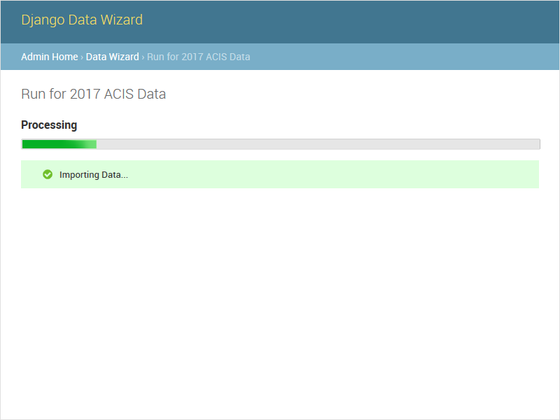

     
# Auto Import

#### `POST /datawizard/[id]/auto`

The `auto` task attempts to run the entire data wizard process from beginning to end.  If any input is needed, the import will halt and redirect to the necessary screen.  If no input is needed, the `auto` task is equivalent to starting the `data` task directly.  This is an asynchronous method, and returns a `task_id` to be used with the status API.

The [run_detail.html] template (and corresponding [RunDetail] React view) provides an example form that initiates the `auto` task.  The `auto` task itself uses the [run_auto.html] template / [RunAuto] view.

The default sequence of tasks is defined by the [`AUTO_IMPORT_TASKS` setting][settings]  Note that the `check_*` tasks do not provide a direct UI or HTTP API.  Instead, these tasks redirect to a corresponding UI task by raising `data_wizard.InputNeeded` if necessary.  For example, `data_wizard.tasks.check_columns` raises `InputNeeded` and redirects to the [columns] task if the spreadsheet contains unexpected column headers.  Once the form is submitted, the [updatecolumns] task processes the user input and runs the check again.  Once the check succeeds (i.e. all columns have been mapped), the user is able to restart the auto task.

Here are the corresponding Input and Form Processing tasks for each of the tasks in the default sequence:

Auto Task | Input Task | Form Processing Task
--|--|--
`check_serializer` | [`list_serializers`][serializers] | [`updateserializer`][updateserializer]
`check_iter` | *N/A* | *N/A*
`check_columns` | [`read_columns`][columns] | [`update_columns`][updatecolumns]
`check_row_identifiers` | [`read_row_identifiers`][ids] | [`update_row_identifiers`][updateids]
[`import_data`][data] | *N/A* | *N/A*

See [Custom Tasks][tasks] for details on customizing the task sequence.

> Source: [`data_wizard.tasks.auto_import`](https://github.com/wq/django-data-wizard/blob/main/data_wizard/tasks.py#L58)

[run_detail.html]: https://github.com/wq/django-data-wizard/blob/master/data_wizard/templates/data_wizard/run_detail.html
[run_auto.html]: https://github.com/wq/django-data-wizard/blob/master/data_wizard/templates/data_wizard/run_auto.html
[RunDetail]: ../views/RunDetail.md
[RunAuto]: ../views/RunAuto.md
[settings]: ../config/settings.md

[serializers]: ./serializers.md
[updateserializer]: ./updateserializer.md
[columns]: ./columns.md
[updatecolumns]: ./updatecolumns.md
[ids]: ./ids.md
[updateids]: ./updateids.md
[data]: ./data.md

[tasks]: ../config/tasks.md
